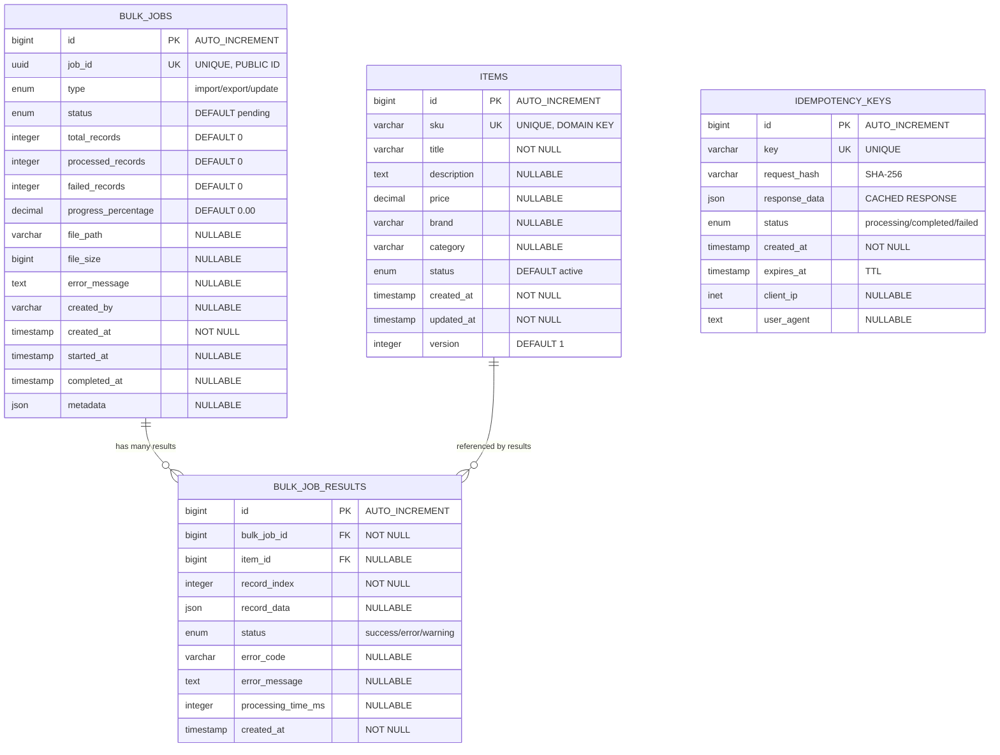

# ER Schema - Data Intake Service

## Entity Relationship Diagram

```
┌─────────────────────────────────────────────────────────────────────────────────┐
│                           DATA INTAKE SERVICE SCHEMA                            │
└─────────────────────────────────────────────────────────────────────────────────┘

┌─────────────────────────────────────────────────────────────────────────────────┐
│                                    ITEMS                                        │
├─────────────────────────────────────────────────────────────────────────────────┤
│ PK │ id                    │ BIGINT        │ AUTO_INCREMENT, PRIMARY KEY        │
│ UK │ sku                   │ VARCHAR(100)  │ UNIQUE, NOT NULL, DOMAIN KEY      │
│    │ title                 │ VARCHAR(255)  │ NOT NULL                          │
│    │ description           │ TEXT          │ NULLABLE                          │
│    │ price                 │ DECIMAL(10,2) │ NULLABLE                          │
│    │ brand                 │ VARCHAR(100)  │ NULLABLE                          │
│    │ category              │ VARCHAR(100)  │ NULLABLE                          │
│    │ status                │ ENUM          │ DEFAULT 'active'                  │
│    │ created_at            │ TIMESTAMP     │ NOT NULL, DEFAULT NOW()           │
│    │ updated_at            │ TIMESTAMP     │ NOT NULL, DEFAULT NOW()           │
│    │ version               │ INTEGER       │ DEFAULT 1, OPTIMISTIC LOCKING    │
├─────────────────────────────────────────────────────────────────────────────────┤
│ INDEXES:                                                                        │
│ • PRIMARY KEY (id)                                                              │
│ • UNIQUE INDEX (sku) - Domain key                                               │
│ • COMPOSITE INDEX (created_at, id) - Cursor pagination                          │
│ • INDEX (status) - Filter active items                                          │
│ • INDEX (brand) - Search by brand                                               │
│ • INDEX (category) - Filter by category                                         │
└─────────────────────────────────────────────────────────────────────────────────┘
                                    │
                                    │ 1:N
                                    │
┌─────────────────────────────────────────────────────────────────────────────────┐
│                              BULK_JOB_RESULTS                                  │
├─────────────────────────────────────────────────────────────────────────────────┤
│ PK │ id                    │ BIGINT        │ AUTO_INCREMENT, PRIMARY KEY        │
│ FK │ bulk_job_id           │ BIGINT        │ NOT NULL → bulk_jobs.id           │
│ FK │ item_id               │ BIGINT        │ NULLABLE → items.id               │
│    │ record_index          │ INTEGER       │ NOT NULL                          │
│    │ record_data           │ JSON          │ NULLABLE                          │
│    │ status                │ ENUM          │ NOT NULL (success/error/warning)  │
│    │ error_code            │ VARCHAR(50)   │ NULLABLE                          │
│    │ error_message         │ TEXT          │ NULLABLE                          │
│    │ processing_time_ms    │ INTEGER       │ NULLABLE                          │
│    │ created_at            │ TIMESTAMP     │ NOT NULL, DEFAULT NOW()           │
├─────────────────────────────────────────────────────────────────────────────────┤
│ INDEXES:                                                                        │
│ • PRIMARY KEY (id)                                                              │
│ • FOREIGN KEY (bulk_job_id) → bulk_jobs.id                                     │
│ • FOREIGN KEY (item_id) → items.id                                             │
│ • COMPOSITE INDEX (bulk_job_id, record_index) - Fast lookup                    │
│ • INDEX (status) - Filter results                                               │
│ • INDEX (error_code) - Error analysis                                           │
└─────────────────────────────────────────────────────────────────────────────────┘
                                    │
                                    │ N:1
                                    │
┌─────────────────────────────────────────────────────────────────────────────────┐
│                                 BULK_JOBS                                       │
├─────────────────────────────────────────────────────────────────────────────────┤
│ PK │ id                    │ BIGINT        │ AUTO_INCREMENT, PRIMARY KEY        │
│ UK │ job_id                │ UUID          │ UNIQUE, NOT NULL, PUBLIC ID       │
│    │ type                  │ ENUM          │ NOT NULL (import/export/update)   │
│    │ status                │ ENUM          │ NOT NULL, DEFAULT 'pending'       │
│    │ total_records         │ INTEGER       │ DEFAULT 0                          │
│    │ processed_records     │ INTEGER       │ DEFAULT 0                          │
│    │ failed_records        │ INTEGER       │ DEFAULT 0                          │
│    │ progress_percentage   │ DECIMAL(5,2)  │ DEFAULT 0.00                       │
│    │ file_path             │ VARCHAR(500)  │ NULLABLE                           │
│    │ file_size             │ BIGINT        │ NULLABLE                           │
│    │ error_message         │ TEXT          │ NULLABLE                           │
│    │ created_by            │ VARCHAR(100)  │ NULLABLE                           │
│    │ created_at            │ TIMESTAMP     │ NOT NULL, DEFAULT NOW()           │
│    │ started_at            │ TIMESTAMP     │ NULLABLE                           │
│    │ completed_at          │ TIMESTAMP     │ NULLABLE                           │
│    │ metadata              │ JSON          │ NULLABLE                           │
├─────────────────────────────────────────────────────────────────────────────────┤
│ INDEXES:                                                                        │
│ • PRIMARY KEY (id)                                                              │
│ • UNIQUE INDEX (job_id) - Public identifier                                     │
│ • INDEX (status) - Filter by status                                             │
│ • INDEX (created_at) - Sort by time                                             │
│ • INDEX (created_by) - Filter by user                                           │
└─────────────────────────────────────────────────────────────────────────────────┘

┌─────────────────────────────────────────────────────────────────────────────────┐
│                              IDEMPOTENCY_KEYS                                  │
├─────────────────────────────────────────────────────────────────────────────────┤
│ PK │ id                    │ BIGINT        │ AUTO_INCREMENT, PRIMARY KEY        │
│ UK │ key                   │ VARCHAR(255)  │ UNIQUE, NOT NULL                  │
│    │ request_hash          │ VARCHAR(64)   │ NOT NULL, SHA-256                 │
│    │ response_data         │ JSON          │ NULLABLE, CACHED RESPONSE         │
│    │ status                │ ENUM          │ NOT NULL (processing/completed/failed) │
│    │ created_at            │ TIMESTAMP     │ NOT NULL, DEFAULT NOW()           │
│    │ expires_at            │ TIMESTAMP     │ NOT NULL, TTL                      │
│    │ client_ip             │ INET          │ NULLABLE                           │
│    │ user_agent            │ TEXT          │ NULLABLE                           │
├─────────────────────────────────────────────────────────────────────────────────┤
│ INDEXES:                                                                        │
│ • PRIMARY KEY (id)                                                              │
│ • UNIQUE INDEX (key) - Idempotency key                                          │
│ • INDEX (expires_at) - TTL cleanup                                              │
│ • INDEX (status) - Monitoring                                                   │
└─────────────────────────────────────────────────────────────────────────────────┘

┌─────────────────────────────────────────────────────────────────────────────────┐
│                              RELATIONSHIPS                                      │
├─────────────────────────────────────────────────────────────────────────────────┤
│                                                                                 │
│  ITEMS (1) ──────────────────── (0..N) BULK_JOB_RESULTS                        │
│     │                              │                                            │
│     │                              │                                            │
│     │                              │                                            │
│  BULK_JOBS (1) ──────────────────── (1..N) BULK_JOB_RESULTS                    │
│                                                                                 │
│  IDEMPOTENCY_KEYS (Independent table - no foreign keys)                        │
│                                                                                 │
│  CARDINALITY:                                                                   │
│  • One item can be referenced by zero or many bulk job results                 │
│  • One bulk job can have one or many results                                   │
│  • Idempotency keys are independent (no relationships)                         │
│                                                                                 │
└─────────────────────────────────────────────────────────────────────────────────┘

┌─────────────────────────────────────────────────────────────────────────────────┐
│                              KEY CONSTRAINTS                                    │
├─────────────────────────────────────────────────────────────────────────────────┤
│                                                                                 │
│  PRIMARY KEYS:                                                                  │
│  • items.id                                                                     │
│  • bulk_jobs.id                                                                 │
│  • bulk_job_results.id                                                          │
│  • idempotency_keys.id                                                          │
│                                                                                 │
│  UNIQUE CONSTRAINTS:                                                            │
│  • items.sku (Domain key)                                                       │
│  • bulk_jobs.job_id (Public identifier)                                        │
│  • idempotency_keys.key (Idempotency key)                                      │
│                                                                                 │
│  FOREIGN KEY CONSTRAINTS:                                                       │
│  • bulk_job_results.bulk_job_id → bulk_jobs.id (CASCADE DELETE)                │
│  • bulk_job_results.item_id → items.id (SET NULL)                              │
│                                                                                 │
│  CHECK CONSTRAINTS:                                                             │
│  • items.price >= 0                                                             │
│  • bulk_jobs.progress_percentage BETWEEN 0 AND 100                             │
│  • bulk_job_results.record_index >= 0                                          │
│                                                                                 │
└─────────────────────────────────────────────────────────────────────────────────┘

┌─────────────────────────────────────────────────────────────────────────────────┐
│                              PERFORMANCE NOTES                                  │
├─────────────────────────────────────────────────────────────────────────────────┤
│                                                                                 │
│  CURSOR PAGINATION:                                                             │
│  • Composite index (created_at, id) enables efficient cursor-based pagination  │
│  • Supports stable sorting and filtering by time ranges                        │
│                                                                                 │
│  DOMAIN INTEGRITY:                                                              │
│  • Unique constraint on items.sku ensures business rule compliance             │
│  • Fast lookups by SKU using unique index                                      │
│                                                                                 │
│  BULK OPERATIONS:                                                               │
│  • Efficient tracking of large-scale data operations                           │
│  • Detailed result logging for audit and debugging                             │
│                                                                                 │
│  IDEMPOTENCY:                                                                   │
│  • Request deduplication through unique keys                                    │
│  • TTL-based cleanup of expired keys                                            │
│                                                                                 │
└─────────────────────────────────────────────────────────────────────────────────┘
```

## Mermaid ER Diagram



## Summary

This ER schema represents a comprehensive data model for the Data Intake Service with:

- **4 main entities**: items, bulk_jobs, bulk_job_results, idempotency_keys
- **Key relationships**: One-to-many between bulk_jobs and bulk_job_results, optional many-to-one between items and bulk_job_results
- **Performance optimizations**: Composite indexes for cursor pagination, unique constraints for domain integrity
- **Scalability features**: UUID public identifiers, JSON metadata fields, TTL-based cleanup
- **Data integrity**: Foreign key constraints, check constraints, optimistic locking

